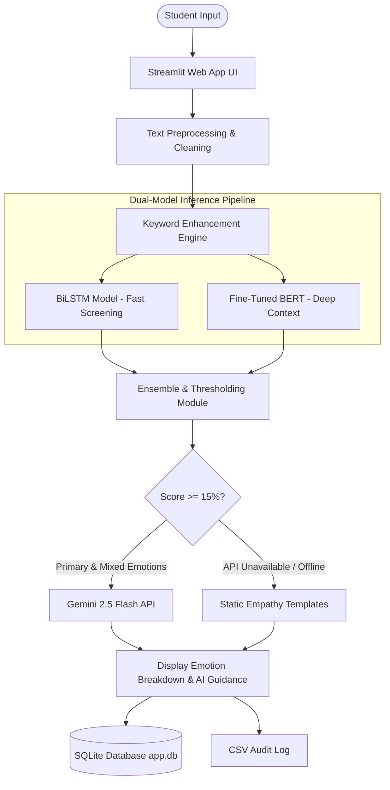
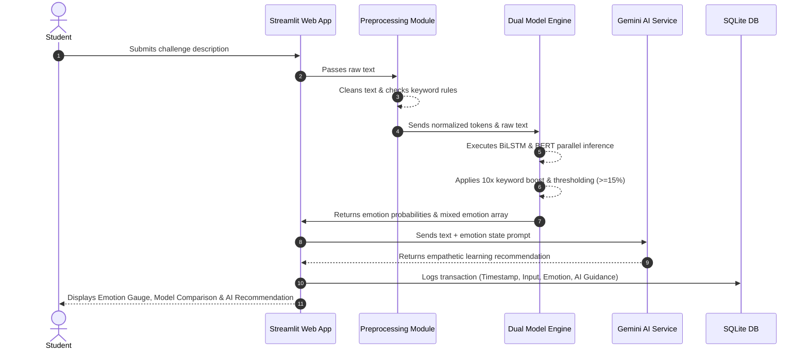

# High-Level Design (HLD) — Emotion Detection & Learning Support Engine

**Project Name:** Emotion Detection & Learning Support Engine  
**Version:** 1.0  
**Status:** Production / Active  

---

## 1. Executive Summary & System Overview

The **Emotion Detection & Learning Support Engine** is an intelligent, AI-powered web platform designed to analyze student query descriptions, detect their underlying emotional state, and generate empathetic, tailored learning guidance.

Students experiencing academic friction often express emotions such as **Boredom**, **Confusion**, **Frustration**, or **Curiosity**. Traditional learning tools treat all queries identically; this engine identifies the student's emotional spectrum using a **Dual-Model ML Architecture (BiLSTM + Fine-Tuned BERT)** and synthesizes customized pedagogical assistance via **Google Gemini AI**.

---

## 2. System Architecture

The application follows a modular, decoupled architecture consisting of five primary layers:
1. **User Interface (UI) Layer** — Streamlit-based web portal with live visualization components.
2. **Preprocessing & Rule Engine Layer** — Text normalization, stopword filtering, and keyword-boosting logic.
3. **Dual-Model Inference Pipeline Layer** — Lightweight BiLSTM classifier running alongside a deep BERT Transformer.
4. **Generative Support Engine Layer** — Integration with Google Gemini 2.5 Flash with static fallback templates.
5. **Persistence & Analytics Layer** — SQLite database (`app.db`) and CSV activity logger.

---

## 3. Core Component Description

### 3.1 Frontend Layer (Streamlit Web Interface)
- **Input Terminal:** Multi-line text field allowing students to input their study challenges.
- **Real-Time Visualizations:** Interactive gauge charts, probability distribution bar plots (via Plotly), and model confidence comparisons.
- **Analytics Dashboard:** Historical trends showing primary emotions by academic domain, average confidence scores over time, and user feedback logs.

### 3.2 Preprocessing & Heuristic Rule Engine
- **Text Normalization:** Lowercasing, URL removal, non-alphabetic filtering, and stopword removal via `NLTK`.
- **Keyword Weight Multiplier:** Rule-based heuristic that applies a $10\times$ weight boost to emotion probability scores when explicit emotional indicator keywords (e.g., *"stuck"*, *"annoying"*, *"mastered"*) are present.

### 3.3 Dual-Model Inference Pipeline
- **BiLSTM (Bidirectional Long Short-Term Memory):** Recurrent neural network trained for fast initial screening (<50ms execution time).
- **BERT Transformer (`bert-base-uncased`):** Fine-tuned transformer architecture for deep contextual sentiment analysis (<300ms execution time).
- **Mixed Emotion Detector:** Flags secondary emotional states whenever score probabilities cross the $15\%$ threshold.

### 3.4 Generative Learning Support Engine
- **Google Gemini 2.5 Flash:** Prompts Gemini with student input and detected emotion matrix to output actionable study strategies, encouragement, and conceptual steps.
- **Fallback Template Handler:** Hand-crafted, pre-written empathy responses for each of the 5 emotion categories if the Gemini API key is unconfigured or rate-limited.

### 3.5 Persistence Layer
- **SQLite DB (`app.db`):** Stores complete transaction history including timestamp, raw input, predicted primary emotion, mixed emotion flags, model probabilities, and generated AI output.
- **CSV Audit Log (`emotion_response_examples.csv`):** Auto-generated runtime backup for offline training and dataset augmentation.

---

## 4. End-to-End Data Flow

---

## 5. Technology Stack & Framework Selection

| Layer | Technology | Justification |
| :--- | :--- | :--- |
| **Language** | Python 3.9+ | Ecosystem standard for Machine Learning and NLP |
| **Web Framework** | Streamlit 1.32.0 | Rapid development, native Plotly support, reactive state |
| **Deep Learning** | TensorFlow / Keras 2.17.0 | BiLSTM model implementation and Keras sequential pipeline |
| **Transformer Stack** | HuggingFace Transformers, PyTorch | BERT tokenization, fine-tuning, and safetensors evaluation |
| **Generative AI** | Google Gemini 2.5 Flash (`google-generativeai`) | High-speed, low-cost generative responses (<1.2s latency) |
| **Visualization** | Plotly 5.18.0, Seaborn, Matplotlib | Dynamic interactive charts and comparative visual graphs |
| **Storage** | SQLite 3, Pandas 2.2.2 | Lightweight embedded relational database and tabular audit logging |

---

## 6. Infrastructure & Performance Optimization

1. **Memory Reduction (85% Savings):** Configured CPU-only PyTorch builds without CUDA libraries, reducing deployment footprint from ~2.7GB to <400MB RAM, completely preventing memory-limit `SIGKILL` crashes on cloud hosting.
2. **Inference Latency Targets:**
   - Preprocessing: `<10ms`
   - BiLSTM Inference: `<50ms`
   - BERT Inference: `<300ms`
   - Gemini Generative Response: `<1.2s`
3. **Fault Tolerance:** Automatic detection of missing model files or API keys with actionable user alerts and static fallbacks.
